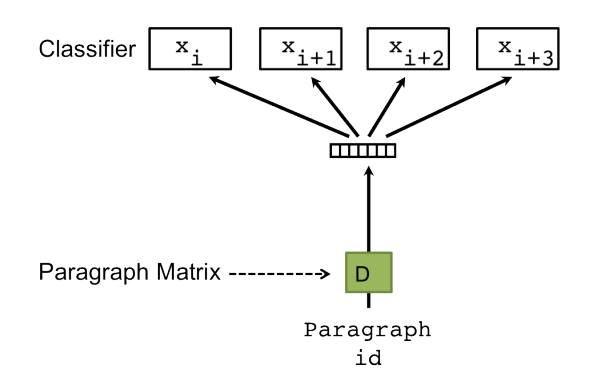
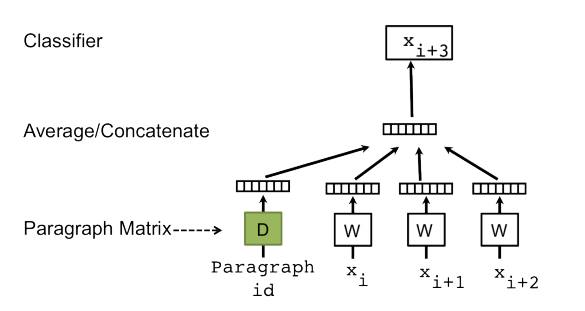
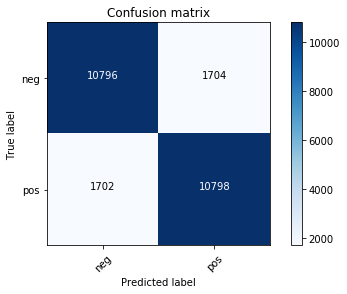

# Doc2vec Sentiment Analysis

**[>> See detail Notebook](Doc2vec%20Sentiment%20Analysis.ipynb)**

Sự thành công của Word2vec đã được chứng minh trong rất nhiều công trình NLP.

Nhắc lại về Word2vec, nó sử dụng 1 tập copus, qua một mạng Neural biểu diễn các word thành các vector, các vector giữ lại được tính chất ngữ nghĩa. Tức các từ mang ý nghĩa similar với nhau thì gần nhau trong không gian vector. Trong NLP, đây một trong những phương thức của word embedding. Word2vec hiện nay được sử dụng hết sức rộng rãi.

Với Doc2vec, ngoài từ (word), ta còn có thể biểu diễn các câu (sentences) thậm chí 1 đoạn văn bản (document). Khi đó, bạn có thể dễ dàng vector hóa cả một đoạn văn bản thành một vector có số chiều cố định và nhỏ, từ đó có thể chạy bất cứ thuật toán classification cơ bản nào trên các vector đó.

Trong notebook này, mình sẽ giới thiệu rất cơ bản basic concept để các bạn có thể hình dung Sentiment sử dụng Doc2vec như thế nào.

# Doc2vec

Doc2vec được giới thiệu bởi Google ([https://arxiv.org/pdf/1507.07998v1.pdf](https://arxiv.org/pdf/1507.07998v1.pdf)), cũng như Word2vec, có 2 model chính là: **DBOW** và **DM**

*  **DBOW** (distributed bag of words): Mô hình này đơn giản là không quan tâm thứ tự các từ, training nhanh hơn, không sử dụng local-context/neighboring. Mô hình chèn thêm 1 "word" là ParagraphID, ParagraphID này đại diện cho văn bản được training. Sau khi training xong có thể hiểu các vector ParagraphID này là vector embedded của các văn bản. Hình ảnh được mô tả trong bài báo:

* **DM** (distributed memory): xem một paragraph là một từ, sau đó nối từ này vào tập các từ trong câu. Trong quá trình training, vector của paragraph và vector từ đều được update.

Tóm lại: ta xem văn bản như là một từ, docID/paragraphID được biểu diễn dạng 1-hot, được embedded vào không gian vector.

# Classification

Có được các vector văn bản từ `Gensim` package. Từ đây bạn có thể sử dụng bất cứ thuật toán phân lớp nào, bạn có thể thực hiện tiếp bước model selection đến khi nào đạt kết quả tốt nhất. Ở đây mình sử dụng `Logistic Regression` và `SVM`, hai thuật toán phân lớp đều cho kết quả khá tốt. 

**Accuracy 0.86376**

Confusion matrix, without normalization

# How to contribute
1. Fork the project on Github
2. Create a topic branch for your changes
3. Ensure that you provide documentation and test coverage for your changes (patches won’t be accepted without)
4. Create a pull request on Github (these are also a great place to start a conversation around a patch as early as possible)

# License

MIT License

Copyright (c) 2017 Van-Duyet Le

Permission is hereby granted, free of charge, to any person obtaining a copy of this software and associated documentation files (the "Software"), to deal in the Software without restriction, including without limitation the rights to use, copy, modify, merge, publish, distribute, sublicense, and/or sell copies of the Software, and to permit persons to whom the Software is furnished to do so, subject to the following conditions:

The above copyright notice and this permission notice shall be included in all copies or substantial portions of the Software.

THE SOFTWARE IS PROVIDED "AS IS", WITHOUT WARRANTY OF ANY KIND, EXPRESS OR IMPLIED, INCLUDING BUT NOT LIMITED TO THE WARRANTIES OF MERCHANTABILITY, FITNESS FOR A PARTICULAR PURPOSE AND NONINFRINGEMENT. IN NO EVENT SHALL THE AUTHORS OR COPYRIGHT HOLDERS BE LIABLE FOR ANY CLAIM, DAMAGES OR OTHER LIABILITY, WHETHER IN AN ACTION OF CONTRACT, TORT OR OTHERWISE, ARISING FROM, OUT OF OR IN CONNECTION WITH THE SOFTWARE OR THE USE OR OTHER DEALINGS IN THE SOFTWARE.
